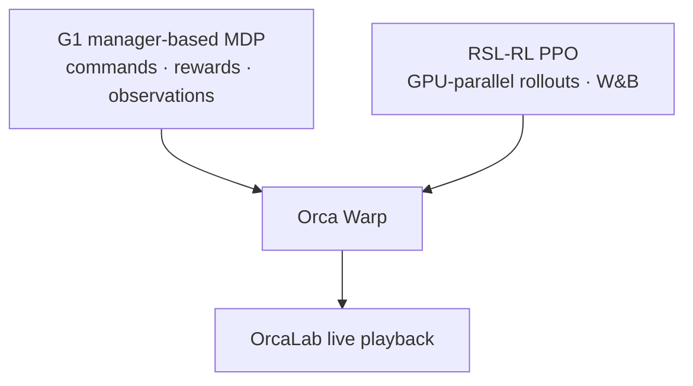

# OrcaLocomotion · Orca Warp

面向 **OrcaLab** 的 GPU 并行机器人强化学习框架：以 manager-based 任务、Orca Warp
批量物理和 RSL-RL PPO 训练为核心，并可在 OrcaLab 中实时回放策略。

> `orca_warp` 是 OrcaLocomotion 的 OrcaLab 实现分支。应用代码只依赖
> `orcalab_rslrl.orca` 公共接口。

## ✨ 特性



- GPU 并行训练、检查、性能测试和回放均通过 `orcarl` CLI。
- 同一 checkpoint 支持 headless 批量回放和 OrcaLab 实时可视化。

| 任务 | 机器人 | 训练与回放 |
| --- | --- | --- |
| `G1-Velocity-Flat` | Unitree G1 29DoF | GPU 并行 RSL-RL / Headless / OrcaLab |

## 🚀 快速开始

需要 Ubuntu 22.04、Python 3.12、NVIDIA GPU 与兼容的 CUDA 驱动。

```bash
git clone --branch orca_warp https://github.com/openverse-orca/OrcaLocomotion.git
cd OrcaLocomotion

conda env create -f environment.yml
conda activate orcalab-rslrl

# 单独安装依赖，下载进度和失败信息会直接显示
python -m pip install --upgrade pip
python -m pip install --prefer-binary -r requirements.txt
python -m pip install -e . --no-deps
```

`environment.yml` 只创建 Python 环境；大型 GPU 与 OrcaLab 依赖在激活环境后单独安装，
避免 Conda 在环境创建阶段长时间无输出。已有 OrcaLab Python 环境时，直接执行上面的
三条 `pip` 命令即可。

## 🏃 训练与回放

训练速度跟踪策略：

```bash
orcarl train --task G1-Velocity-Flat \
  --num-envs 4096 --device cuda:0 \
  --runner-config configs/train/ppo.yaml \
  --wandb-mode online
```

checkpoint 默认保存到 `logs/rsl_rl/`，最终模型为 `model_final.pt`。使用
`--wandb-mode offline` 或 `disabled` 可关闭云端记录；用 `--resume <checkpoint>` 续训。

headless 批量回放：

```bash
orcarl play --task G1-Velocity-Flat \
  --checkpoint logs/rsl_rl/model_final.pt \
  --num-envs 300 --device cuda:0
```

性能检查：

```bash
orcarl benchmark --task G1-Velocity-Flat --num-envs 4096 --steps 500 --device cuda:0
```

## OrcaLab 可视化

首次使用前，在 OrcaLab 资产平台订阅 **`unitree_robots`**，然后重启或刷新
OrcaLab；默认 G1 prefab 为：

```text
assets/e071469a36d3c8aa/unitree_robots/prefabs/g1_29dof_usda
```

订阅只影响 OrcaLab 可视化，headless 训练和回放使用仓库内置 XML/mesh。

训练时渲染前 16 个环境：

```bash
orcarl train --task G1-Velocity-Flat \
  --num-envs 4096 --device cuda:0 \
  --orcalab --render-num-envs 16 --render-fps 30
```

在 OrcaLab 中启动 bridge 后，为回放增加 `--orcalab`；远程 bridge 使用
`--orca-addr <host>:50051`。实时渲染会降低吞吐，基准测试与正式训练应关闭它。

## 配置与扩展

| 层级 | 入口 | 内容 |
| --- | --- | --- |
| 运行参数 | `orcarl train/play/inspect` | 设备、环境数、checkpoint、渲染和 bridge 地址 |
| 算法参数 | `configs/train/ppo.yaml` | PPO、网络、rollout 和 W&B |
| 任务参数 | `orcalab_rslrl/tasks/` | MDP、奖励、观测、随机化与终止条件 |

- [配置指南](docs/configuration.md)：参数优先级与 Python 配置
- [案例手册](docs/examples.md)：训练、回放与自定义资产
- [架构文档](docs/architecture.md)：模块边界与运行时职责

本地 G1 资产在 `orcalab_rslrl/assets/robots/unitree_g1/`；`--asset <local.xml>`
可覆盖训练模型，`--asset-path <orca_asset_path>` 可覆盖 OrcaLab prefab。

## Python API

```python
from orcalab_rslrl.orca import OrcaRuntimeConfig, make_env

config = OrcaRuntimeConfig(num_envs=1024, device="cuda:0", headless=True, seed=42)
env = make_env("G1-Velocity-Flat", config)
try:
    observations = env.get_observations()
finally:
    env.close()
```

MDP term 通过 `env.orca` 读取批量状态，例如 `env.orca.state.qpos`、
`env.orca.joint_qvel()` 和 `env.orca.sensor(name)`；不要导入 `_internal` 模块。

## 引用

如果本项目对你的研究有帮助，请引用：

```bibtex
@software{hu_orcalocomotion_orca_warp,
  author = {Huan Hu},
  title = {OrcaLocomotion: Orca Warp},
  year = {2026},
  url = {https://github.com/openverse-orca/OrcaLocomotion/tree/orca_warp}
}
```

完整的引用元数据见 [`CITATION.cff`](CITATION.cff)。
