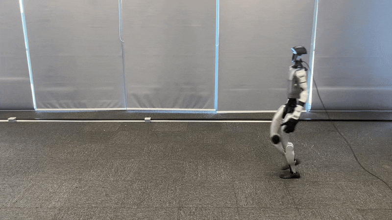

# OrcaLocomotion

OrcaLocomotion is an OrcaLab training extension for Unitree robot locomotion policies.
Train policies and play them back in OrcaLab.

| Simulation | Physical |
| --- | --- |
|  |  |

## Supported Tasks

| Task | Training | OrcaLab playback |
| --- | --- | --- |
| `Unitree-Go2-Flat` | Unitree/mjlab | `orca_rl.run_play` |
| `Unitree-Go2-Rough` | Unitree/mjlab | `orca_rl.run_play` |
| `Unitree-G1-Flat` | Unitree/mjlab | `orca_rl.run_play` |

## Installation

Ubuntu 22.04 with an NVIDIA GPU is recommended for training. A display is only
needed when playing policies in OrcaLab.

```bash
git clone https://github.com/openverse-orca/OrcaLocomotion.git
cd OrcaLocomotion

# System dependencies for building bundled C++ extensions
sudo apt install -y libyaml-cpp-dev libboost-all-dev libeigen3-dev libspdlog-dev libfmt-dev

conda create -n orca_rl python=3.12
conda activate orca_rl

pip install -r requirements.txt
```

If you need to install the OrcaLab dependency separately:

```bash
pip install orca-lab==26.4.3
```

> **OrcaLab prerequisite:** Playback requires the `unitree_robots` asset subscribed
> in OrcaLab. The project uses the GO2 and G1 robot prefabs from this asset package.

## Training

Train with the bundled Unitree/mjlab project. These commands run the native
mjlab trainer headlessly and write checkpoints under
`third_party/unitree_rl_mjlab/logs/rsl_rl/`.

```bash
cd third_party/unitree_rl_mjlab
python scripts/train.py Unitree-Go2-Flat --env.scene.num-envs=4096
python scripts/train.py Unitree-Go2-Rough --env.scene.num-envs=4096
python scripts/train.py Unitree-G1-Flat --env.scene.num-envs=4096
```

The resulting checkpoints can be passed to OrcaLocomotion playback.

## Playback

Start OrcaLab, then run the playback CLI from the repository root:

```bash
python -m orca_rl.run_play --config Unitree-Go2-Flat --checkpoint <checkpoint.pt>
python -m orca_rl.run_play --config Unitree-Go2-Rough --checkpoint <checkpoint.pt>
python -m orca_rl.run_play --config Unitree-G1-Flat --checkpoint <checkpoint.pt>
```

Use a checkpoint produced by the Unitree/mjlab training step.

> **Note:** `Unitree-Go2-Rough` requires a terrain asset subscription in OrcaLab.
> To request additional asset imports, please [open an issue](https://github.com/openverse-orca/OrcaLocomotion/issues).

## Assets

`Unitree-Go2-Rough` publishes this rough-terrain visual asset by default when
playing in the OrcaLab scene:

```text
assets/001d46537b9e555b/mjlabrough5x5xml_v2/prefabs/terrain_usda
```

If you import your own OrcaLab terrain asset, pass the new spawnable asset path
to `python -m orca_rl.run_play` with `--rough-terrain-asset <orca_asset_path>`.
You can also change the scene actor name with `--rough-terrain-actor <actor_name>`.

The XML files below are local MuJoCo collision maps bundled with this repository,
mainly for `--local-mujoco --local-terrain-map`. They are not the visual asset
auto-published into the OrcaLab scene. When `--local-terrain-map` is used without
an explicit value, rough tasks use `assets/terrain/mjlab_rough_5x5_xml/terrain.xml`
and flat tasks use `assets/terrain/orca_primitive_terrain_xml/terrain.xml`.

| Asset | Use |
| --- | --- |
| `assets/terrain/orca_primitive_terrain_xml/terrain.xml` | Terrain testing |
| `assets/terrain/mjlab_rough_5x5_xml/terrain.xml` | Go2 rough terrain playback |

## Acknowledgments

Training tasks and robot assets are built with reference to
[unitree_rl_mjlab](https://github.com/unitreerobotics/unitree_rl_mjlab), using
[mujocolab/mjlab](https://github.com/mujocolab/mjlab) as the training backend.
Users may choose other third-party extension projects based on mjlab.
